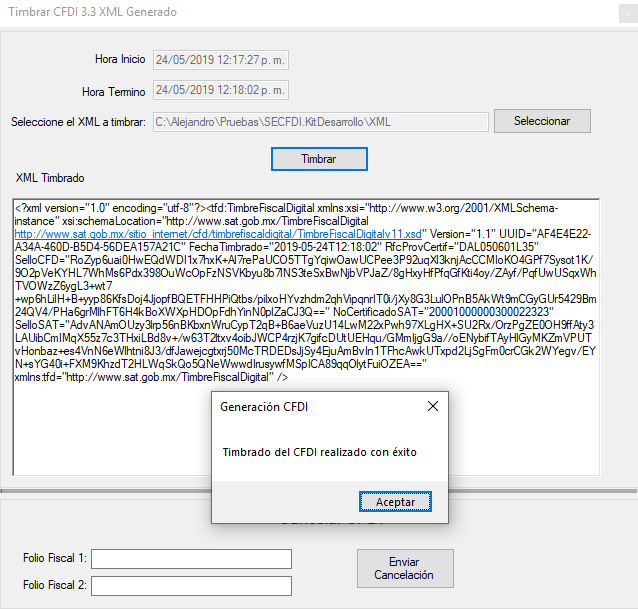

<div align="center">


# Código en C# del Servicio Web  para Timbrar y Cancelar


</div>

Este es el ejemplo de uso para consumir el **Servicio Web en C#  para generar Facturas, Notas, Recibos, Nómina, Carta Porte, Complemento de Pagos, etc)**.

Este servicio es ideal cuando ya generas el XML por medios propios y solo necesitas el timbrado. La integración es fácil y rápida en 10 minutos estarás emitiendo en nuestro ambiente de pruebas los CFDI la puesta en producción en menos de 1 hora.

Además el Servicio Web permitirá **cancelar uno o varios CFDI**

## Requerimientos

Se recomienda usar el IDE de desarrollo Visual Studio 2017 community o superior. Todas las versiones community son gratuitas y se pueden descargar desde https://visualstudio.microsoft.com/es/vs/community/

## Instalación

Obten la última versión de FacturoPorTi C# en:

    git clone https://github.com/facturoporti/factura-electronica-Web-Service-C-Sharp.git


## Timbrar

Descarga el repositorio que contiene lo necesarios para realizar el proceso de timbrado. 


Selecciona el archivo presiona timbrar, el sistema realizará lo siguiente: 

```csharp

if (txtArchivoXML.Text.Trim().Length == 0)
            {
                MessageBox.Show("Seleccione un archivo antes de continuar.", "Error al Timbrar Documento");
            }
            else
            {
                txtFechaInicio.Text = DateTime.Now.ToString();
                
                Cursor.Show();
                Cursor.Current = Cursors.WaitCursor;

                CertificarClient certificar = new CertificarClient();                
                AutenticarPeticion autenticar = new AutenticarPeticion();
                TimbrarCFDIPeticion xml = new TimbrarCFDIPeticion();

                // Asigna los parametros de configuracion de conexion 
                autenticar.Usuario = "PruebasTimbrado";
                autenticar.Contrasenia = "@Notiene1";

                // abre el archivo XMl que fue seleccionado
                FileStream resultado = null;
                resultado = new FileStream(txtArchivoXML.Text, FileMode.Open, FileAccess.Read, FileShare.Read);
                using (StreamReader contenidoArchivo = new StreamReader(resultado))
                {
                    xml.XMLEntrada = contenidoArchivo.ReadToEnd();
                    contenidoArchivo.Close();
                }
                
                TimbrarCFDIRespuesta respuesta = certificar.TimbradoMultiEmpresas(autenticar, xml); 

                certificar.Close();

                txtFechaTermino.Text = DateTime.Now.ToString();

                if (respuesta.Estatus.Codigo == "000")
                {
                    txtXMLTimbrado.Text = respuesta.Timbrado.TimbreXML;
                }
                
                MessageBox.Show(respuesta.Estatus.Descripcion, "Generación CFDI");

                Cursor.Current = Cursors.Default;
            }
```

## XML Timbrado

Al término el sistema te indica el resultado del timbrado además te mostrará el timbre fiscal:




Versión de C# usada

```
Visual Studio 2017 Community con Framework 4.5 
```


## Cancelar

Ingresa el folio fiscal (UUID) para realizar la cancelación: 


```csharp
if (txtFolioFiscal1.Text.Trim().Length == 0 && txtFolioFiscal2.Text.Trim().Length == 0)
            {
                MessageBox.Show("Ingrese al menos un Folio Fiscal antes de continuar.", "Error al cancelar el CFDI");
            }
            else
            {
                // Genera XMl con los Folios a enviar se pueden enviar uno o mas CFDI para cancelacion 
                // Solo se podran enviar CFDI timbrados con nuestro servicio no hay el limite de CFDI que se puean cancelar

                Cursor.Show();
                Cursor.Current = Cursors.WaitCursor;
              
                CertificarClient certificar = new CertificarClient();
                AutenticarPeticion autenticar = new AutenticarPeticion();
                CancelarCFDIPACPeticion cancelar = new CancelarCFDIPACPeticion();

                // Asigna los parametros de configuracion de conexion 
                autenticar.Usuario = "PruebasTimbrado";
                autenticar.Contrasenia = "@Notiene1";

                cancelar.RFC = "AAA010101AAA"; // RFC del emisor del CFDI;
                cancelar.Password = "12345678a";

                Archivos archivo = new Archivos();                
                cancelar.PFX = archivo.ConvertirStreamToByte(archivo.Abrir(ObtieneDirectorioAplicacion() + @"\Certificado\AAA010101AAA.pfx"));  //"Se debe de enviar el certificado en formato PFX para realizar la cancelacion";

                List<string> folios = new List<string>();

                if (!string.IsNullOrEmpty(txtFolioFiscal1.Text))
                    folios.Add(txtFolioFiscal1.Text.Trim());

                if (!string.IsNullOrEmpty(txtFolioFiscal2.Text))
                    folios.Add(txtFolioFiscal2.Text.Trim());

                cancelar.UUID = folios.ToArray(); 

                CancelarCFDIRespuesta respuesta =  certificar.CancelarCFDICualquierPAC(autenticar, cancelar);

                certificar.Close();

                txtFechaTermino.Text = DateTime.Now.ToString();

                Cursor.Current = Cursors.Default;

                // No hay limite para el envio de cancelaciones en el ejemplo solo en envian 3 pero pueden ser todos los que el usuario 
                // desee cancelar al mismo tiempo
                for (int contador = 0; contador < respuesta.FoliosRespuesta.Length; contador++)
			    {
                    if (respuesta.FoliosRespuesta[contador].Estatus != null)
                        MessageBox.Show(respuesta.FoliosRespuesta[contador].Estatus.Descripcion, "Generación CFDI");
			    }

            }
```

## Probar Cancelación de CFDI

Ejecuta el botón enviar cancelación, antes de ejecutar el código deberás de actualizar los valores con tus datos fiscales; al término de la ejecución obtendrás la respuesta: 


## Documentación Adicional

Si deseas mas información del servicio web descarga la guía de integración,   contiene todos los atributos y su descripción además de los valores que son permitidos http://software.facturoporti.com.mx/WebService/Manual-Integracion-Web-Service.pdf


## Contribuir

1. Fork el repositorio 

2. Clona el repositorio

    git clone git@github.com:yourUserName/factura-electronica-Web-Service-C-Sharp.git


3. Crea una rama 
```
    git checkout desarrollo
    git pull al original desarrollo
    # Podrás escoger el nombre de tu rama
    git checkout -b <feature/my_branch>
```
4. Haz los cambios necesarios y commit para carga los
```
    git add .
    git commit -m "mis cambios"
```
5. Envía los cambios a GitHub
```
    git push origin <feature/my_branch>
```

***-

## License

Desarrollado en México por [FacturoPorTi](https://www.FacturoPorTi.com). Available with [MIT License](LICENSE).
****


